<p align="center">
  
</p>

<p align="center">
  Sapling shielded transactions, built from scratch in Rust, one small level at a time.<br>
  <sub>작은 레벨 하나씩, 손으로 짓는 차폐 트랜잭션.</sub>
</p>

## 이건 뭔가

Zcash의 Sapling 차폐 트랜잭션을 Rust로 밑바닥부터 지어 보는 학습 레포다. 금액 타입 하나에서 시작해 한 칸씩 쌓는다. 끝에는 내 손으로 만든 Ironwood 트랜잭션이 로컬 regtest에서 블록에 담긴다.

공부한 흔적이지 라이브러리가 아니다. 이 코드로 진짜 돈을 다루지 않는다.

## 어떻게 나아가나

걸음의 단위는 레벨이다. 레벨 하나는 30~45분이고, 새로 배우는 것도 통과 기준도 하나다. 이름 있는 테스트가 초록이 되면 깃발이 선다.

레벨이 몇 개 모이면 월드가 된다. 월드 끝에는 보스가 있다. 보스는 새 개념 없이 그 월드를 묶어 남는 것 하나를 만든다.

레벨을 푸는 방식은 여덟 가지다. 보기 · 예측 · 고치기 · 쓰기 · 써 보기 · 대조 · 깨기 · 보스. 진짜 Zcash crate나 테스트 벡터는 네 레벨을 넘기지 않고 다시 나온다.

튜터는 Claude Code다. 설명하고, 테스트와 뼈대를 깔고, 막히면 힌트를 준다. 핵심 줄은 내가 쓰고, 그 줄을 한 문장으로 설명할 수 있어야 레벨이 닫힌다. 튜터와의 약속은 [CLAUDE.md](CLAUDE.md)에, 지나온 길은 [PROGRESS.md](PROGRESS.md)에 적는다.

## 지금 여기

W1 금액. Zcash가 돈을 세는 단위 zatoshi로 금액 타입을 만든다. 이 월드의 보스는 L05 「정답지와 대조」다. 내 타입이 `zcash_protocol`과 같은 답을 내면 깬다.

지금 레벨과 막힌 곳은 [PROGRESS.md](PROGRESS.md)에 있다. 이 레포에서 Claude Code에게 "튜터 세션 시작"이라고 말하면 그 레벨이 열린다.

## 트로피 선반

월드를 깨면 한 칸씩 채운다.

<p>
  
</p>

첫 칸은 W1 보스 L05에서 채워진다.

<details>
<summary>가는 길의 이정표</summary>

<br>

- M1 곡선 위의 점을 더하고 곱하고, 32바이트로 접었다 편다. <sub>Jubjub 점 산술</sub>
- M2 내가 만든 해시로 빈 노트 트리의 뿌리를 낸다. <sub>Pedersen hash</sub>
- M3 노트 하나의 내용을 가린 채로 약속한다. <sub>note commitment</sub>
- M4 받는 사람이 열 수 있는 노트를 만든다. <sub>note encryption</sub>
- M5 쓸 때마다 다른 얼굴로 서명한다. <sub>재랜덤화 서명, RedJubjub</sub>
- M6 첫 영지식 증명을 만들고, 제약 하나를 빼면 거짓도 통과한다는 걸 직접 본다. <sub>Groth16, under-constrained</sub>
- M7 내가 지은 회로로 출력이 올바르다는 걸 증명한다. <sub>Output 회로</sub>
- M8 노트를 쓰는 증명을 만든다. 회로는 crate 것을 빌린다. <sub>Spend description</sub>
- M9 차폐 송금 한 건을 만들고, 내가 만든 검증기로 통과시킨다. <sub>z→z 트랜잭션</sub>
- M10 받은 노트를 찾아 다시 보내는 작은 지갑이 두 바퀴 돈다. <sub>Sapling 지갑</sub>
- M11 손으로 만든 Ironwood 트랜잭션이 로컬 regtest에서 채굴된다. <sub>NU6.3, v6 트랜잭션</sub>

M1, M5, M9, M11 뒤에는 거기까지를 정리한 글을 한 편씩 쓴다.

</details>

## 돌려 보기

```sh
# 전체 테스트
cargo test

# 한 모듈만
cargo test value

# 아직 잠긴 테스트 목록
cargo test -- --ignored --list
```

빨간 테스트는 언제나 지금 레벨 것뿐이다. 아직 열지 않은 레벨의 테스트는 `#[ignore = "L03"]`처럼 잠가 두고, 그 레벨을 열 때 푼다. 그래서 `cargo test`가 빨갛다면 고장이 아니라 지금 풀 문제다.

툴체인은 `rust-toolchain.toml`의 stable이다.

## 파일

- `src/` 레벨을 깰 때마다 조금씩 자라는 코드
- `PROGRESS.md` 지금 레벨, 월드 체크리스트, 세션 로그
- `CLAUDE.md` 튜터와의 약속
- `Cargo.toml` `ff`/`group` 0.13 생태계에 맞춘 핀. 주석 처리된 crate는 처음 필요한 레벨에서 푼다
- `rust-toolchain.toml` stable
- `assets/` 배너와 트로피

## 고마운 것들

- [Zcash Protocol Specification](https://zips.z.cash/protocol/protocol.pdf). 모든 정답의 출처.
- [zcash-test-vectors](https://github.com/zcash/zcash-test-vectors). 대조 레벨의 정답지.
- [zcash](https://github.com/zcash)와 [zkcrypto](https://github.com/zkcrypto)의 Rust crate들. 손으로 지은 것을 맞춰 보는 기준.
- 배너의 등불 가디언(Lantern Guardian)은 [piatoss.xyz](https://piatoss.xyz)에서 왔다.
